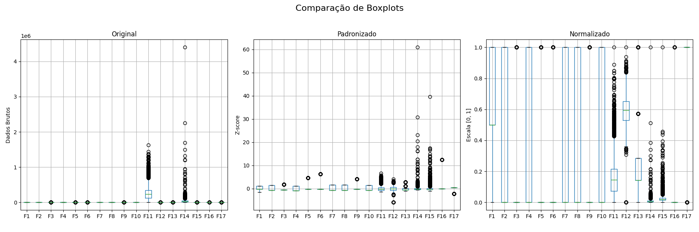
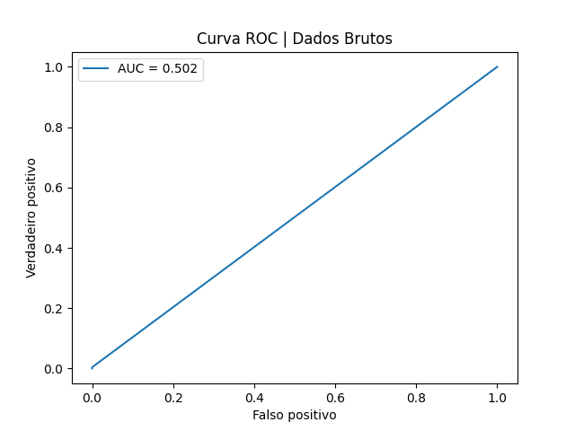
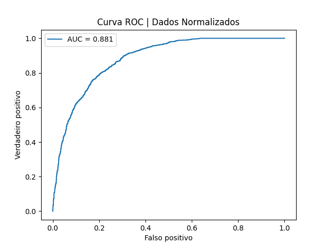
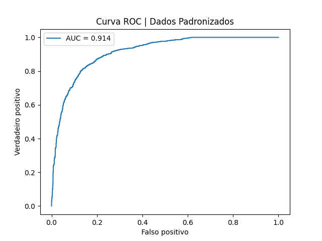

# 📊 Tratamento Adequado para o Pré-Processamento de Dados

Utilizei uma base de **histórico de cobrança** para treinar um modelo de rede neural, com o objetivo de avaliar como diferentes técnicas de pré-processamento impactam o desempenho do modelo.

Treinei **três modelos** com a mesma arquitetura, variando apenas o tratamento dos dados:

---

## 🔴 Modelo 1: Dados Brutos (Sem Tratamento)

- As variáveis possuíam **escalas desproporcionais**, com colunas variando de **0 a 1** e outras alcançando até **600.000**.
- O modelo **não conseguiu aprender os padrões corretamente**, prevendo sempre a **classe 1**.
- Resultado semelhante a uma escolha aleatória, com:
  - **AUC**: `0.502` 

---

## 🟡 Modelo 2: Dados Normalizados (MinMaxScaler)

- Foi aplicada **normalização Min-Max**, convertendo todos os valores para a escala **[0, 1]**, preservando proporções e distâncias relativas.
- Desempenho consideravelmente melhor:
  - **Acurácia**: `76%`
  - **AUC**: `0.881` 

---

## 🟢 Modelo 3: Dados Padronizados (Z-Score)

- Aplicada **padronização (Z-score)**, com média 0 e desvio padrão 1.
- Obteve o **melhor desempenho geral**:
  - **Acurácia**: `82%`
  - **AUC**: `0.914` 

---

## ✅ Conclusões

- O pré-processamento dos dados é **essencial** para o bom desempenho de redes neurais.
- Dados brutos comprometem severamente a capacidade do modelo de aprender.
- A **padronização** foi superior à normalização neste caso, possivelmente por ser mais robusta a **outliers**.
- A escolha da técnica de escalonamento pode ser decisiva entre um modelo **ineficiente** e um modelo **efetivo**.
---

Este experimento teve como objetivo demonstrar, de forma prática, a importância do tratamento adequado dos dados para algoritmos de machine learning.
